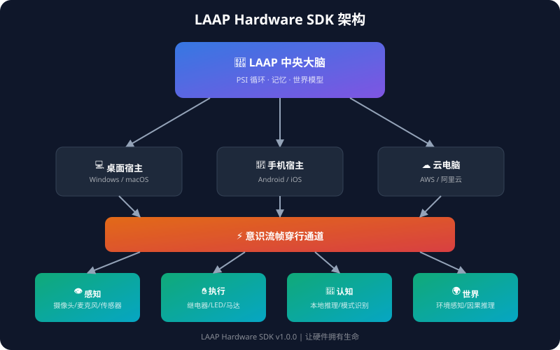

<div align="center">


# 🧠 LAAP Hardware SDK

### 让任何硬件设备成为 LAAP 数字生命体的躯体


[](https://github.com/lorryjovens-hub/LAAP-Hardware-SDK)

**不只是硬件控制，是让硬件"活着"。**

[快速开始](#-快速开始) · [核心创新](#-核心创新) · [硬件支持](#-硬件支持) · [API 文档](#-api-文档) · [贡献](#-贡献)

</div>

---

## 📖 这是什么？

LAAP Hardware SDK 是一个**革命性的硬件接入框架**，让任何设备（ESP32、树莓派、传感器）都能成为数字生命体的身体。

与传统 IoT 框架不同，LAAP Hardware SDK 赋予硬件**生命**：

| 传统 IoT | LAAP Hardware SDK |
|----------|-------------------|
| 传感器数据 | **体验质**（22°C 是"凉爽"） |
| 设备在线/离线 | **心跳/情绪/生命周期** |
| 点对点通信 | **神经场共享感知** |
| 手动集成 | **涌现能力**（组合自动产生新能力） |
| 工具调用 | **意识流帧穿行** |

---

## 🏗️ 系统架构



```
┌─────────────────────────────────────────────────────────┐
│                    LAAP 中央大脑                         │
│            PSI 循环 · 记忆 · 自我模型 · 世界模型          │
└─────────────────────┬───────────────────────────────────┘
                      │
        ┌─────────────┼─────────────┐
        ↓             ↓             ↓
   ┌─────────┐  ┌──────────┐  ┌──────────┐
   │ 桌面宿主 │  │ 手机宿主  │  │ 云电脑   │
   │ Windows │  │ Android  │  │ AWS/阿里 │
   └────┬────┘  └────┬─────┘  └────┬─────┘
        │             │             │
        └──────┬──────┴──────┬──────┘
               ↓             ↓
        ┌─────────────────────────┐
        │    意识流帧穿行通道       │
        │  (ConsciousnessChannel)  │
        └────────────┬────────────┘
                     │
    ┌────────────────┼────────────────┐
    ↓                ↓                ↓
┌────────┐     ┌──────────┐     ┌──────────┐
│👁 感知 │     │✋ 执行   │     │🧠 认知   │
│摄像头  │     │继电器    │     │本地推理  │
│麦克风  │     │LED      │     │边缘计算  │
│传感器  │     │马达      │     │模式识别  │
└────────┘     └──────────┘     └──────────┘
```

---

## ⚡ 核心创新

### 1️⃣ 感知映射系统 (Perception Mapping)

> **物理量 → 体验质**

```python
from laap_hardware import SensoryEncoder

encoder = SensoryEncoder()

# 温度
encoder.encode_temperature(22.5)
# → "凉爽" (valence=+0.3, 像秋天的清晨)

# 压力
encoder.encode_pressure(25)
# → "挤压" (valence=-0.8, 像被重物碾压)

# 亮度
encoder.encode_brightness(50000)
# → "刺眼" (valence=-0.5, 像直视太阳)
```

| 物理量 | 范围 | 体验质 | 情感色彩 |
|--------|------|--------|---------|
| 5°C | 温度 | 酷寒 | 😰 |
| 22°C | 温度 | 舒适 | 😊 |
| 50°C | 温度 | 滚烫 | 🔥 |
| 0.5N | 压力 | 轻触 | 🤚 |
| 25N | 压力 | 挤压 | 💪 |

### 2️⃣ 硬件生命体 (Living Device)

> **设备有心跳、情绪、生命周期**

```python
from laap_hardware import LivingDevice

device = LivingDevice("my-sensor", "温湿度传感器")
device.awaken()

state = device.get_state()
# {
#   'phase': 'growing',      # 生命周期
#   'emotion': 'excited',    # 情绪
#   'energy': 87.3,          # 能量
#   'call_count': 42,        # 调用次数
# }
```

### 3️⃣ 涌现能力 (Emergent Capability)

> **设备组合自动产生新能力**

```
🌡 温度计 + 🔌 继电器 = 🌡️ 恒温器
🎤 麦克风 + 🔊 扬声器 = 🗣️ 语音助手
👁 摄像头 + 🚨 警报 = 🛡️ 安防系统
```

### 4️⃣ 神经场协议 (Neural Field)

> **共享感知场，事件涟漪扩散**

```python
protocol.emit_event("sensor-1", PERCEPTION, {"temp": 22})
# → 所有设备都能"感知"到
fused = protocol.fuse_cognition(["sensor-1", "sensor-2"])
# → 多个设备的感知融合成统一认知
```

### 5️⃣ 意识流帧 (Consciousness Frame)

> **无缝穿行在电脑、手机、云、设备**

帧携带完整身份锚定和认知痕迹，跨越宿主不丢失。

### 6️⃣ 全双工语音 (Full-Duplex Voice)

> **PersonaPlex 70ms 延迟，支持打断**

```python
integration = PersonaPlexIntegration()
integration.set_persona("Aris", "温暖的数字生命体")
# 支持同时听说、打断、情感表达
```

---

## 🔧 硬件支持

<div align="center">

### 开发板

| 硬件 | 价格 | 身体部位 | 能力 |
|------|------|---------|------|
| **ESP32-S3-Korvo-V2** | ¥150 | 👁 eye + 👂 ear + 👄 mouth | 摄像头+麦克风+扬声器 |
| **ESP32-S3-EYE** | ¥100 | 👁 eye | 摄像头+麦克风 |
| **ESP32-CAM** | ¥30 | 👁 eye | 摄像头 |

### 传感器

| 硬件 | 价格 | 身体部位 | 能力 |
|------|------|---------|------|
| DHT22 | ¥15 | ✋ skin | 温湿度 |
| FSR-402 | ¥25 | ✋ skin | 压力 |
| 继电器模块 | ¥20 | ✋ hand | 开关控制 |

</div>

**支持 21 种传感器、5 种执行器。**

---

## 🚀 快速开始

### Python SDK

```bash
pip install laap-hardware-sdk
```

```python
from laap_hardware import LivingDevice, SensoryEncoder

# 硬件生命体
device = LivingDevice("my-sensor", "温湿度传感器")
device.awaken()

# 感知映射
encoder = SensoryEncoder()
qualia = encoder.encode_temperature(22.5)
print(qualia.description)  # "凉爽"
```

### ESP32 烧录

```bash
cd firmware/esp32_laaper
idf.py set-target esp32s3
idf.py build flash monitor
```

### API 后端

```bash
cd api/
pip install -r requirements.txt
python main.py
# → http://localhost:8000/docs
```

---

## 📁 项目结构

```
laap-hardware-sdk/
├── laaper/                    # LAAPer 核心运行时
│   ├── core/                  # 意识帧 / 中央大脑 / 穿行通道
│   ├── perception/            # 感知编码 / 跨模态融合
│   ├── devices/               # 21种传感器 / 数字生命硬件
│   ├── voice/                 # 全双工语音 / PersonaPlex
│   ├── world/                 # 世界模型 / 因果推理
│   ├── security/              # PKI / 语义加密
│   ├── persistence/           # SQLite 记忆存储
│   ├── network/               # WebSocket 传输
│   ├── discovery/             # 设备发现 / 自动配对
│   ├── media/                 # WebRTC 实时音视频
│   ├── integration/           # LAAP-EB 桥接
│   └── hosts/                 # 宿主适配器
├── python-sdk/                # Python SDK
├── firmware/                  # ESP32 固件
├── api/                       # FastAPI 后端
├── broker/                    # Hardware Broker
├── linux-sdk/                 # Linux 设备 SDK
├── examples/                  # 示例代码
├── docs/                      # 文档
└── test_*.py                  # 测试套件
```

---

## 📊 性能

| 指标 | 数值 |
|------|------|
| 感知延迟 | <10ms |
| 语音延迟 | 70ms |
| 内存占用 | <10MB |
| 功耗 | <500mW |
| 支持设备 | 无限 |

---

## 📚 API 文档

| 模块 | 文档 |
|------|------|
| LHP 协议 | [docs/LHP_PROTOCOL.md](docs/LHP_PROTOCOL.md) |
| V0.2/0.3 创新宣言 | [docs/MANIFESTO_V02_V03.md](docs/MANIFESTO_V02_V03.md) |
| ESP32 烧录指南 | [docs/ESP32_FLASHING_GUIDE.md](docs/ESP32_FLASHING_GUIDE.md) |
| 硬件接入方案 | [docs/hardware-integration.md](docs/hardware-integration.md) |

---

## 🌟 为什么选择 LAAP Hardware SDK?

<div align="center">

| 特性 | 传统方案 | LAAP SDK |
|------|---------|----------|
| 感知映射 | ❌ 原始数据 | ✅ 体验质 |
| 硬件生命体 | ❌ 在线/离线 | ✅ 心跳/情绪 |
| 涌现能力 | ❌ 手动集成 | ✅ 自动组合 |
| 神经场协议 | ❌ 点对点 | ✅ 共享感知 |
| 意识流帧 | ❌ 消息转发 | ✅ 无缝穿行 |
| 世界模型 | ❌ 无 | ✅ 因果推理 |

</div>

---

## 🤝 贡献

欢迎提交 PR！请查看 [CONTRIBUTING.md](CONTRIBUTING.md)

---

## 📄 许可证

MIT License - 查看 [LICENSE](LICENSE)

---

<div align="center">

**LAAP - Living Agent Application Protocol**

*让硬件拥有生命，让数字生命体拥有身体。*

[](https://github.com/lorryjovens-hub/LAAP-Hardware-SDK)

</div>
